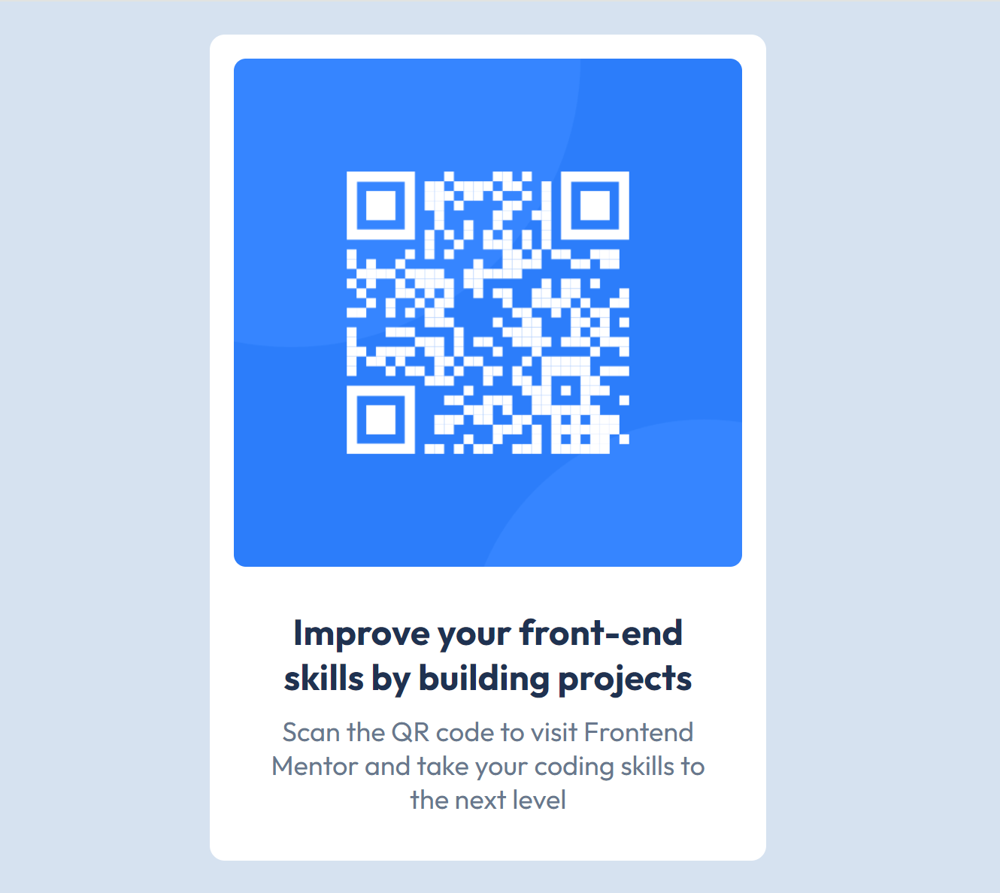

# Frontend Mentor - QR code component solution

This is a solution to the [QR code component challenge on Frontend Mentor](https://www.frontendmentor.io/challenges/qr-code-component-iux_sIO_H). Frontend Mentor challenges help you improve your coding skills by building realistic projects. 

## Table of contents

- [Overview](#overview)
  - [Screenshot](#screenshot)
  - [Links](#links)
- [My process](#my-process)
  - [Built with](#built-with)
  - [What I learned](#what-i-learned)
  - [Continued development](#continued-development)
  - [Useful resources](https://chatgpt.com)
- [Author](#author)
- [Acknowledgments](#acknowledgments)

**Note: Delete this note and update the table of contents based on what sections you keep.**

## Overview

### Screenshot

Add a screenshot of your solution. The easiest way to do this is to use Firefox to view your project, right-click the page and select "Take a Screenshot". You can choose either a full-height screenshot or a cropped one based on how long the page is. If it's very long, it might be best to crop it.

### Links

- Solution URL: [Github repo to the code for the challenge](https://github.com/AllisonFavour/fm-challenge1)
- Live Site URL: [Vercel link to view the challenge](fm-qrcode-challenge1.vercel.app)

## My process

Started by using HTML to give the structure of the layout and having the CSS styling in mind.

### Built with

- Semantic HTML5 markup
- CSS custom properties and Flexbox

### What I learned

I use this challenge to relearn the basics of web development which is HTML and CSS. 
In my HTML file, i used the Outfit font from google fonts using the provided link tag from google fonts. I also linked my CSS file using the link tag.

This project reminded me the importance of using HTML to arrange the contents to make it much more easier to style the contents and components using CSS. Following the provided figma design, i had to use a div with the class name of 'main' which holds another div with the class name of 'container' which is a parent to two child div with the respective class names of 'box' and 'box2', 'box' holds the QR code image and 'box2' holds the h1 and p tags.

The reason i had to arrange my contents like that was to achieve a pixel perfect similarity with the provided figma image, it will be clearer explaining the CSS file.
So basically, the CSS file starts with the CSS reset (i added comment to help with clarity for whoever wants to read the code), then i used the CSS variables to store the font and colors this practice helps with writing less repetitive code especially for a large project where you will have to use the same colors and fonts for differents sections and pages. The font and colors were provided alongside the figma design so it really helped coding out the figma design.

Using the class selector i selected the div with the class name of 'main', i set the background color to the provided color using the CSS variable i stored, i also used min-width, max-width and min-height this helps with responsive and since it is a relatively simple project it is responsive for both small and big screens due to the way i utilized the sizes, also made use of display flex, and other flex properties to center the child div to 'main' which is 'container'.

Afterwards, on the div with the class name 'container' i gave it the white background to follow the figma design provided, then gave it a max-width of 370px which should make it responsive for smaller screens especially. Then selecting the the QR code image i gave it a width of 100% to make sure it is responsive and takes the width of its parent which has the class name of 'box', also gave it an height and added border radius to make the four edges curvy.

Then on 'box2' the sibling to 'box' both children to the parent div 'container', i gave it some basic styles by adding the appropriate color, padding, margin and centralizing the texts with text-align: center.

### Continued development

Hopefully, as time goes on i will get to learn about more on accessibility, thinking about it i realized how essential it is to follow a top accessibility and HTML semantic approach to help with all kinds of users trying to access our websites and web apps.

## Author

- Website - [Allison Favour](https://allison-favour-portfolio-darkmode.vercel.app/)
- Frontend Mentor - [@AllisonFavour](https://www.frontendmentor.io/profile/AllisonFavour)
- Twitter - [@TrillestOjay](https://x.com/TrillestOjay)

## Acknowledgments

Thanks to random google searches and claude AI for some quick assistance and certain reminders and suggestions and thanks to frontendmentor for this platform of practicing hands-on project.

